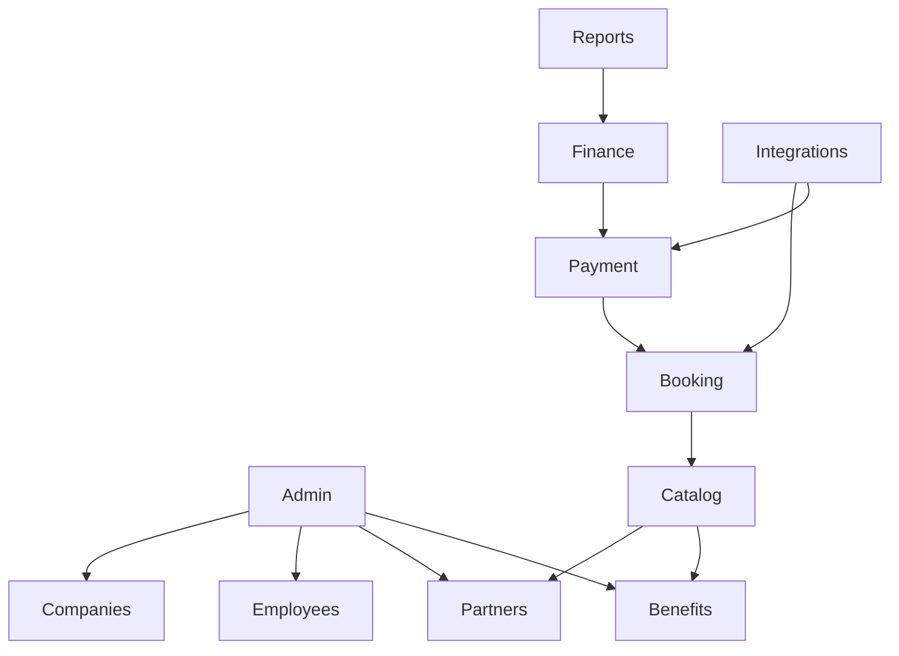

# Module Map

## Objetivo

Este documento define a divisão oficial dos módulos da plataforma Presscard.

Cada responsabilidade deve pertencer exatamente a um módulo.

Caso exista dúvida sobre onde implementar uma funcionalidade, este documento deve ser consultado antes de iniciar o desenvolvimento.

---

# Princípios

Cada módulo possui responsabilidade única.

Um módulo nunca deve conhecer detalhes internos de outro módulo.

A comunicação deve ocorrer através de contratos públicos.

---

# Visão Geral

---

# Administração

Responsável por:

- usuários administrativos;
- permissões;
- perfis;
- parâmetros da plataforma;
- configurações globais.

Nunca implementar regras de negócio neste módulo.

---

# Empresas

Responsável por:

- Empresas Associadas;
- configurações da empresa;
- políticas da empresa;
- funcionários vinculados.

---

# Funcionários

Responsável por:

- cadastro;
- autenticação;
- perfil;
- histórico;
- preferências.

---

# Parceiros Comerciais

Responsável por:

- cadastro de parceiros;
- categorias;
- localização;
- contatos;
- recursos oferecidos.

---

# Benefícios

Responsável por:

- descontos;
- regras comerciais;
- elegibilidade;
- campanhas.

Nunca realizar reservas.

Nunca realizar pagamentos.

---

# Catálogo

Responsável por:

- busca;
- filtros;
- categorias;
- detalhes dos parceiros;
- descoberta de benefícios.

Não realiza reservas.

---

# Reservas

Responsável por:

- reservas;
- disponibilidade;
- calendário;
- cancelamentos;
- histórico.

Não calcula comissão.

Não calcula pagamento.

---

# Pagamentos

Responsável por:

- checkout;
- PIX;
- cartão;
- status;
- comprovantes.

Não calcula benefícios.

---

# Financeiro

Responsável por:

- comissão;
- repasses;
- indicadores;
- conciliação.

---

# Relatórios

Responsável por:

- dashboards;
- estatísticas;
- indicadores;
- exportações.

---

# Integrações

Responsável por:

- APIs externas;
- Webhooks;
- sincronização;
- provedores;
- Google Maps;
- Omnibees;
- parceiros.

---

# Dependências

## Administração

Não depende de módulos de negócio.

---

## Empresas

Depende apenas de Administração.

---

## Funcionários

Depende de Empresas.

---

## Parceiros

Independente.

---

## Benefícios

Depende de:

- Empresas
- Parceiros

---

## Catálogo

Depende de:

- Parceiros
- Benefícios

---

## Reservas

Depende de:

- Catálogo

---

## Pagamentos

Depende de:

- Reservas

---

## Financeiro

Depende de:

- Pagamentos

---

## Relatórios

Pode consumir informações dos demais módulos.

Nunca alterar dados.

---

## Integrações

Pode consumir contratos públicos dos módulos.

Nunca acessar implementações internas.

---

# Regras

Uma funcionalidade deve pertencer apenas a um módulo.

Caso uma funcionalidade pareça pertencer a vários módulos:

1. identificar o verdadeiro responsável;
2. mover a responsabilidade para o módulo correto;
3. expor contratos para os demais.

Nunca duplicar regras de negócio.

---

# Checklist

Antes de criar uma funcionalidade verificar:

☐ Existe módulo responsável?

☐ Existe funcionalidade semelhante?

☐ Existe contrato reutilizável?

☐ Está respeitando a responsabilidade do módulo?

---

# Histórico

## Versão 1.0.0

- Criação do mapa oficial de módulos.