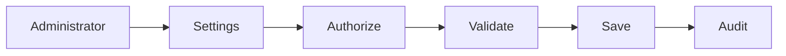

# Flows

```mermaid
flowchart LR
A[Administrator] --> B[Settings] --> C[Authorize] --> D[Validate] --> E[Save] --> F[Audit]
```

```mermaid
flowchart LR
A[Administrator] --> B[Role] --> C[Permissions] --> D[Authorize] --> E[Save] --> F[Audit]
```

## Implementação

☐ Não iniciado  ☐ Parcial  ☐ Completo
