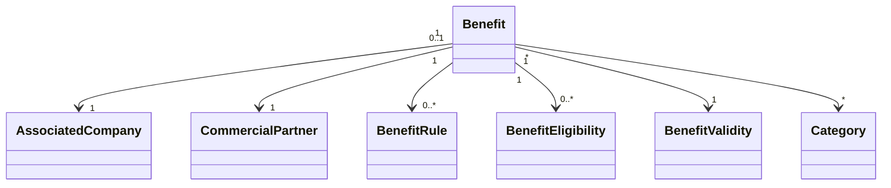

# Benefits Entities

## Objetivo

Este documento descreve as entidades conceituais do módulo Benefits.

Não representa diretamente o modelo físico do banco de dados.

## Diagrama

## Benefit

Representa o benefício disponibilizado pela Associated Company.

Atributos conceituais:

- Id
- CompanyId
- PartnerId
- Name
- Description
- Status
- CreatedAt
- UpdatedAt
- PublishedAt

## BenefitRule

Representa a condição comercial.

Exemplos:

- percentual;
- valor fixo;
- preço especial;
- limite de utilização.

Atributos conceituais:

- Type
- Value
- MinimumValue
- MaximumValue
- UsageLimit

## BenefitEligibility

Representa quem pode utilizar o benefício.

Exemplos:

- todos os Employees;
- departamento;
- cargo;
- unidade;
- grupo.

## BenefitValidity

Representa o período de validade.

Atributos:

- StartDate
- EndDate

## Relacionamentos

Um Benefit:

- pertence a uma Associated Company;
- pode estar associado a um Commercial Partner;
- possui regras;
- possui critérios de elegibilidade;
- possui validade;
- pode possuir categorias.

## Histórico

O valor e as regras utilizadas em uma operação devem ser preservados no contexto da operação para garantir rastreabilidade.

## Implementação

Status

☐ Não iniciado
☐ Parcial
☐ Completo
