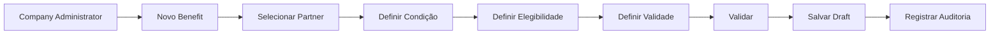
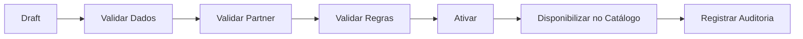
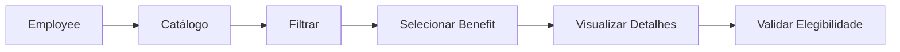
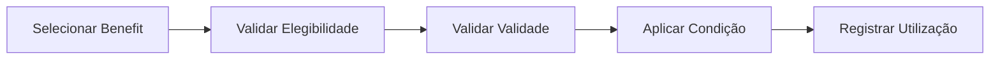
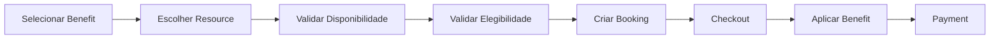
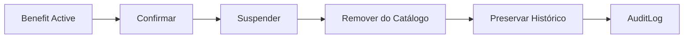
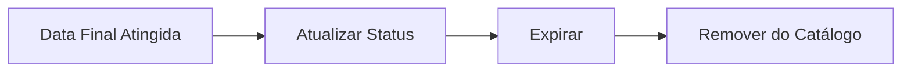

# Benefits Flows

## Criar Benefit

## Publicar

## Consultar catálogo

## Utilizar Benefit sem Booking

## Utilizar Benefit com Booking

## Suspender

## Expiração

## Implementação

Status

☐ Não iniciado
☐ Parcial
☐ Completo
