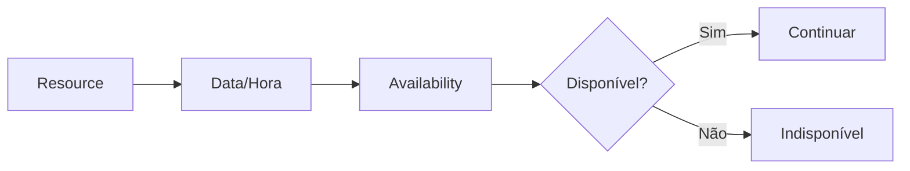

# Booking Availability

## Objetivo

Determinar se um Reservable Resource pode ser reservado para determinado período.



## Disponibilidade interna

Considerar reservas, bloqueios, capacidade e regras do recurso.

## Disponibilidade externa

```text
Presscard → Provider Adapter → External Provider → Availability
```

O fornecedor externo permanece como fonte de verdade para seu inventário.

## Revalidação

Quando houver risco de concorrência ou exigência do fornecedor, revalidar antes da confirmação.

## Falhas

Não assumir disponibilidade em caso de erro externo. Registrar erro e permitir nova tentativa.

## Implementação

☐ Não iniciado  ☐ Parcial  ☐ Completo
