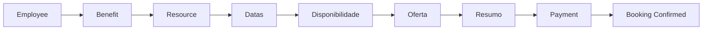
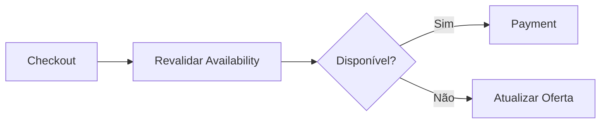
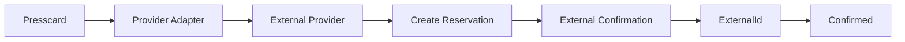
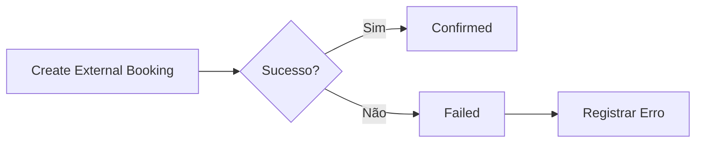
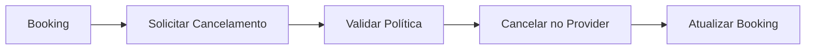

# Booking Flows

## Reserva padrão

## Revalidação

## Reserva externa

## Falha externa

## Cancelamento

Toda mudança de status deve gerar histórico.

## Implementação

☐ Não iniciado  ☐ Parcial  ☐ Completo
