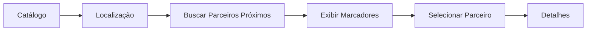

# Catalog Flows

## Abrir catálogo

```mermaid
flowchart LR
A[Employee]
--> B[Catálogo]
--> C[Validar Tenant]
--> D[Carregar Benefits Disponíveis]
--> E[Exibir Resultados]
```

## Pesquisar

```mermaid
flowchart LR
A[Digite Pesquisa]
--> B[Search Service]
--> C[Aplicar Tenant]
--> D[Aplicar Elegibilidade]
--> E[Ranking]
--> F[Resultados]
```

## Filtrar

```mermaid
flowchart LR
A[Resultados]
--> B[Selecionar Filtros]
--> C[Aplicar Filtros]
--> D[Atualizar Resultados]
```

## Mapa

```mermaid
flowchart LR
A[Catálogo]
--> B[Localização]
--> C[Buscar Parceiros Próximos]
--> D[Exibir Marcadores]
--> E[Selecionar Parceiro]
--> F[Detalhes]
```

## Detalhes

```mermaid
flowchart LR
A[Resultado]
--> B[Detalhes do Benefit]
--> C[Validar Elegibilidade]
--> D[Exibir Condição]
--> E[Reservar ou Utilizar]
```

## Booking

```mermaid
flowchart LR
A[Benefit]
--> B[Reservable Resource]
--> C[Disponibilidade]
--> D[Booking]
--> E[Checkout]
```

## Implementação

Status

☐ Não iniciado
☐ Parcial
☐ Completo
