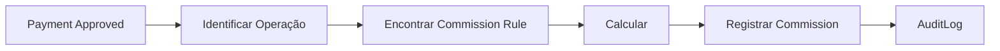
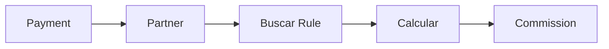
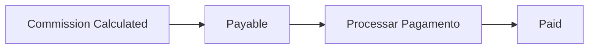
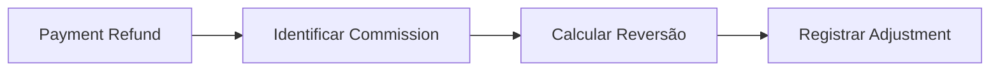

# Commissions Flows

## Geração

## Regra por Partner

## Pagamento da comissão

## Cancelamento

## Refund

## Falha

Se o cálculo falhar:

- Payment permanece preservado;
- erro deve ser registrado;
- comissão deve permanecer em estado consistente;
- processamento deve poder ser reexecutado de forma idempotente.

## Implementação

☐ Não iniciado  ☐ Parcial  ☐ Completo
