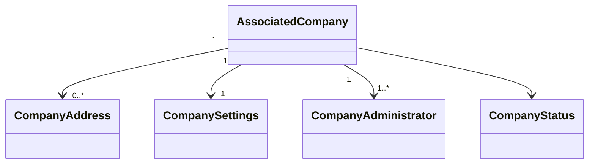

# Companies Entities

## Objetivo

Este documento descreve as entidades conceituais do módulo Companies. Não representa diretamente o modelo físico do banco de dados.

## Diagrama

## AssociatedCompany

Representa a organização cliente da Presscard e o Tenant do sistema.

Principais atributos conceituais:

- Id
- LegalName
- TradeName
- Document
- Email
- Phone
- Status
- CreatedAt
- UpdatedAt
- ActivatedAt
- DeactivatedAt

## CompanyAddress

Representa o endereço institucional da empresa.

Atributos:

- Id
- Street
- Number
- Complement
- District
- City
- State
- PostalCode
- Country

## CompanySettings

Representa configurações específicas do Tenant.

Exemplos:

- nome exibido;
- regras internas;
- preferências de comunicação;
- configurações de catálogo;
- configurações de benefícios.

## CompanyAdministrator

Representa o vínculo de um usuário administrativo com a Associated Company.

Atributos:

- Id
- UserId
- CompanyId
- Role
- Status
- CreatedAt

## CompanyStatus

Estados possíveis:

- Configuration
- Active
- Suspended
- Deactivated

## Relacionamentos

Uma Associated Company:

- possui endereços;
- possui configurações;
- possui administradores;
- possui Employees;
- pode possuir Benefits;
- pode utilizar Commercial Partners.

## Implementação

Status

☐ Não iniciado
☐ Parcial
☐ Completo
