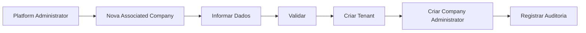
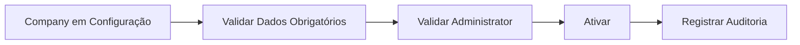
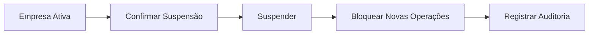
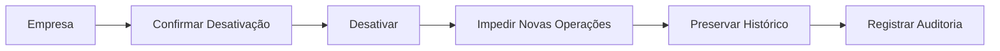

# Companies Flows

## Cadastro



## Ativação



## Atualização


## Suspensão



## Desativação



## Consulta pelo Company Administrator


## Erro de Tenant

```text
Requisição
  ↓
Autenticação
  ↓
Autorização
  ↓
Validar Tenant
  ↓
Tenant incompatível
  ↓
Acesso negado
  ↓
Registrar evento de segurança
```

## Implementação

Status

☐ Não iniciado
☐ Parcial
☐ Completo
