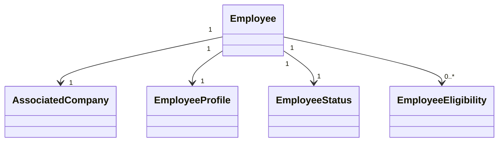

# Employees Entities

## Objetivo

Este documento descreve as entidades conceituais utilizadas pelo módulo Employees.

Não representa diretamente o modelo físico do banco de dados.

## Diagrama

## Employee

Representa o funcionário vinculado a uma Associated Company.

Atributos conceituais:

- Id
- UserId
- CompanyId
- Status
- CreatedAt
- UpdatedAt
- ActivatedAt
- DeactivatedAt

## EmployeeProfile

Representa dados de perfil.

Exemplos:

- Nome
- Sobrenome
- Email
- Telefone
- Foto
- Data de nascimento, quando aplicável
- Preferências

## EmployeeStatus

Estados:

- Invited
- Pending
- Active
- Suspended
- Deactivated

## EmployeeEligibility

Representa critérios adicionais para determinar se o Employee pode utilizar determinado benefício ou campanha.

Exemplos:

- departamento;
- cargo;
- unidade;
- grupo;
- campanha.

## Relacionamentos

Employee:

- pertence a uma Associated Company;
- pode utilizar Benefits;
- pode criar Bookings;
- pode realizar Payments;
- possui histórico.

## Dados de autenticação

Credenciais devem ser tratadas pelo mecanismo de autenticação da plataforma.

O domínio Employee não deve armazenar senhas.

## Implementação

Status

☐ Não iniciado
☐ Parcial
☐ Completo
