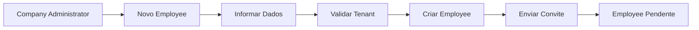
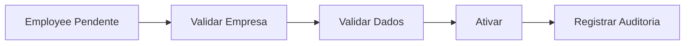
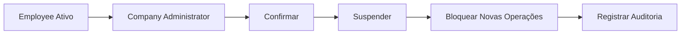
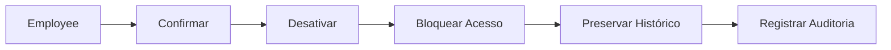
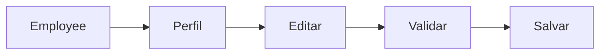
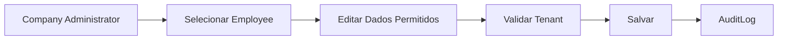
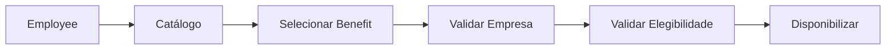

# Employees Flows

## Convite



## Primeiro acesso


## Ativação



## Suspensão



## Desativação



## Atualização de perfil



## Alteração administrativa



## Acesso a benefício



## Acesso indevido

```text
Requisição
  ↓
Autenticação
  ↓
Autorização
  ↓
Validar Tenant
  ↓
Tenant incompatível
  ↓
Acesso negado
  ↓
Registrar evento de segurança
```

## Implementação

Status

☐ Não iniciado
☐ Parcial
☐ Completo
