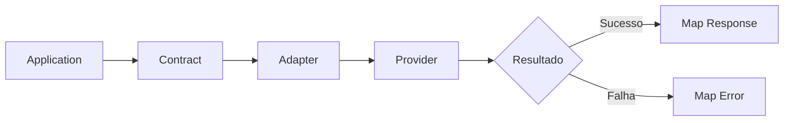

# Flows

```mermaid
flowchart LR
A[Application] --> B[Contract] --> C[Adapter] --> D[Provider]
D --> E{Resultado}
E -->|Sucesso| F[Map Response]
E -->|Falha| G[Map Error]
```

```mermaid
flowchart LR
A[Webhook] --> B[Authenticate] --> C[Validate] --> D[Idempotency] --> E[Process] --> F[Update Domain] --> G[Audit]
```

## Implementação

☐ Não iniciado  ☐ Parcial  ☐ Completo
