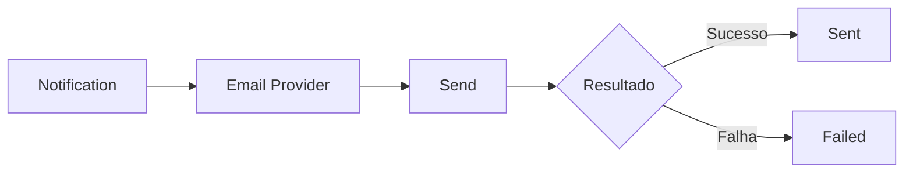
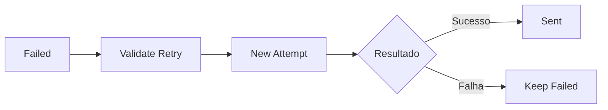

# Notifications Flows

## Notificação transacional

```mermaid
flowchart LR
A[Business Event] --> B[Notification Service] --> C[Template] --> D[Create] --> E[Channel] --> F[Send] --> G[Delivery Status]
```

## Email

```mermaid
flowchart LR
A[Notification] --> B[Email Provider] --> C[Send] --> D{Resultado}
D -->|Sucesso| E[Sent]
D -->|Falha| F[Failed]
```

## Reprocessamento

```mermaid
flowchart LR
A[Failed] --> B[Validate Retry] --> C[New Attempt] --> D{Resultado}
D -->|Sucesso| E[Sent]
D -->|Falha| F[Keep Failed]
```

## Preferências

```mermaid
flowchart LR
A[Event] --> B[Recipient] --> C[Preferences] --> D[Allowed Channel] --> E[Send]
```

## Implementação

☐ Não iniciado  ☐ Parcial  ☐ Completo
