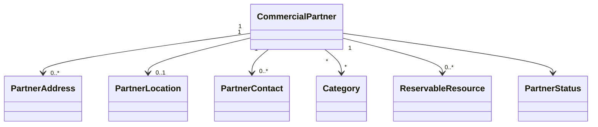

# Partners Entities

## Objetivo

Este documento descreve as entidades conceituais utilizadas pelo módulo Partners.

Não representa diretamente o modelo físico do banco de dados.

## Diagrama

## CommercialPartner

Representa uma empresa parceira da plataforma.

Atributos conceituais:

- Id
- LegalName
- TradeName
- Document
- Description
- Email
- Phone
- Website
- Status
- CreatedAt
- UpdatedAt

## PartnerAddress

Representa endereço físico ou comercial.

Atributos:

- Id
- Street
- Number
- Complement
- District
- City
- State
- PostalCode
- Country

## PartnerLocation

Representa a localização geográfica.

Atributos:

- Latitude
- Longitude
- Accuracy
- Source
- UpdatedAt

A localização deve ser adequada para integração com mapas.

## PartnerContact

Representa canais de contato.

Exemplos:

- telefone;
- WhatsApp;
- email;
- website;
- redes sociais.

## Category

Classifica o parceiro.

Exemplos:

- Hotel
- Restaurante
- Locadora
- Academia
- Farmácia
- Cinema

## ReservableResource

Representa um recurso que pode ser reservado.

Exemplos:

- quarto;
- veículo;
- mesa;
- serviço.

## PartnerStatus

Estados:

- Draft
- UnderReview
- Active
- Suspended
- Deactivated

## Relacionamentos

CommercialPartner pode:

- atender várias Associated Companies;
- possuir vários Benefits indiretamente por meio das empresas;
- possuir vários Reservable Resources;
- possuir várias categorias.

## Implementação

Status

☐ Não iniciado
☐ Parcial
☐ Completo
