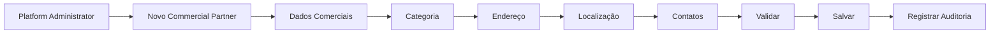
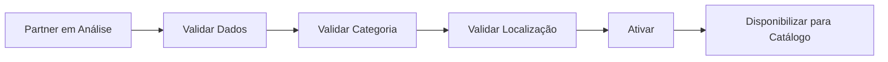
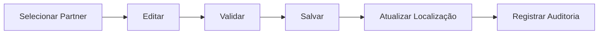
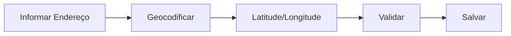
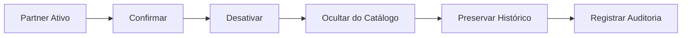
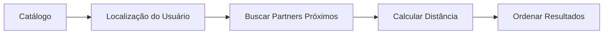

# Partners Flows

## Cadastro

## Ativação

## Atualização

## Localização

## Desativação

## Cadastro de recurso

## Busca por localização

## Implementação

Status

☐ Não iniciado
☐ Parcial
☐ Completo
