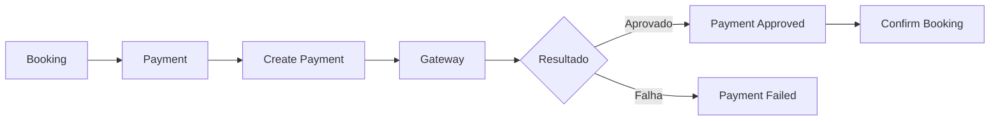
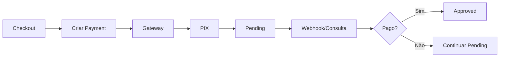
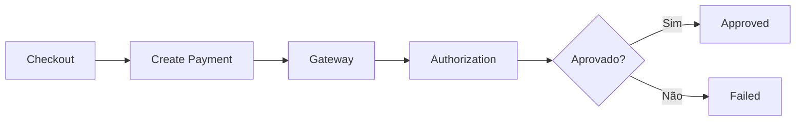
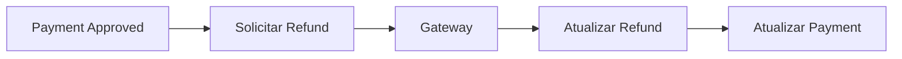
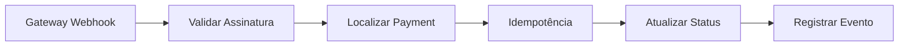

# Payments Flows

## Pagamento de Booking

## PIX

## Cartão

## Estorno

## Falha

Uma falha de gateway deve:

- atualizar status;
- registrar referência do erro quando apropriado;
- preservar histórico;
- permitir nova tentativa quando a operação permitir.

## Webhook

## Implementação

☐ Não iniciado  ☐ Parcial  ☐ Completo
