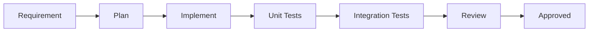
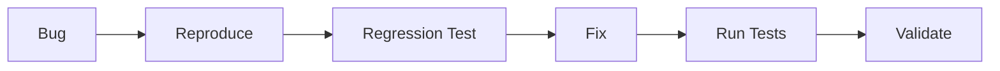
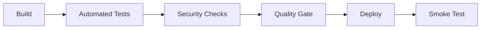

# Flows

```mermaid
flowchart LR
A[Requirement] --> B[Plan] --> C[Implement] --> D[Unit Tests] --> E[Integration Tests] --> F[Review] --> G[Approved]
```

```mermaid
flowchart LR
A[Bug] --> B[Reproduce] --> C[Regression Test] --> D[Fix] --> E[Run Tests] --> F[Validate]
```

```mermaid
flowchart LR
A[Build] --> B[Automated Tests] --> C[Security Checks] --> D[Quality Gate] --> E[Deploy] --> F[Smoke Test]
```

## Implementação

☐ Não iniciado  ☐ Parcial  ☐ Completo
