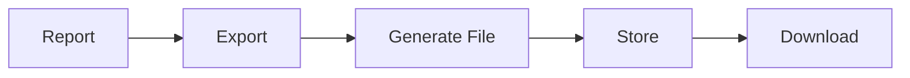

# Flows

```mermaid
flowchart LR
A[User] --> B[Dashboard/Report] --> C[Authorize] --> D[Apply Tenant] --> E[Query] --> F[Result]
```

```mermaid
flowchart LR
A[Report] --> B[Export] --> C[Generate File] --> D[Store] --> E[Download]
```

## Implementação

☐ Não iniciado  ☐ Parcial  ☐ Completo
