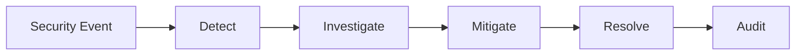

# Flows

```mermaid
flowchart LR
A[Request] --> B[Authenticate] --> C[Authorize] --> D[Validate Tenant] --> E[Operation] --> F[Audit] --> G[Response]
```

```mermaid
flowchart LR
A[Security Event] --> B[Detect] --> C[Investigate] --> D[Mitigate] --> E[Resolve] --> F[Audit]
```

## Implementação

☐ Não iniciado  ☐ Parcial  ☐ Completo
