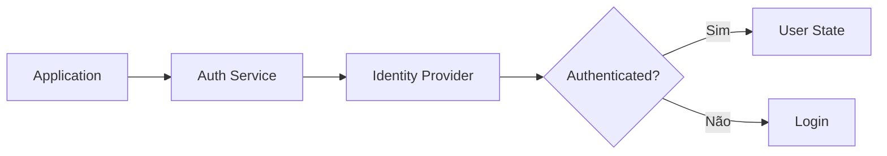

# Authentication

## Responsabilidades

- iniciar login;
- manter estado de autenticação;
- recuperar usuário atual;
- encerrar sessão;
- reagir à expiração;
- encaminhar usuário para a área correta.

## Princípio

O frontend representa o estado de autenticação, mas a API continua responsável por validar identidade e autorização.

## Fluxo

## Estado

O estado deve distinguir:

- inicializando;
- autenticado;
- não autenticado;
- erro.

Evitar representar todos esses estados apenas com boolean.

## Implementação

☐ Não iniciado
☐ Parcial
☐ Completo
