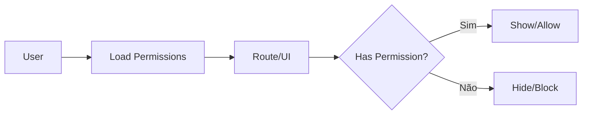

# Authorization

## Princípios

- Permission deve ser representada por código estável.
- Componentes podem ocultar ações sem permissão.
- Guards podem impedir navegação.
- O backend deve sempre repetir a autorização.
- Nunca considerar uma ação escondida como protegida.

## Exemplos

```text
employees.read
employees.write
benefits.read
benefits.write
reports.read
settings.write
audit.read
```

## Fluxo



## Implementação

☐ Não iniciado
☐ Parcial
☐ Completo
