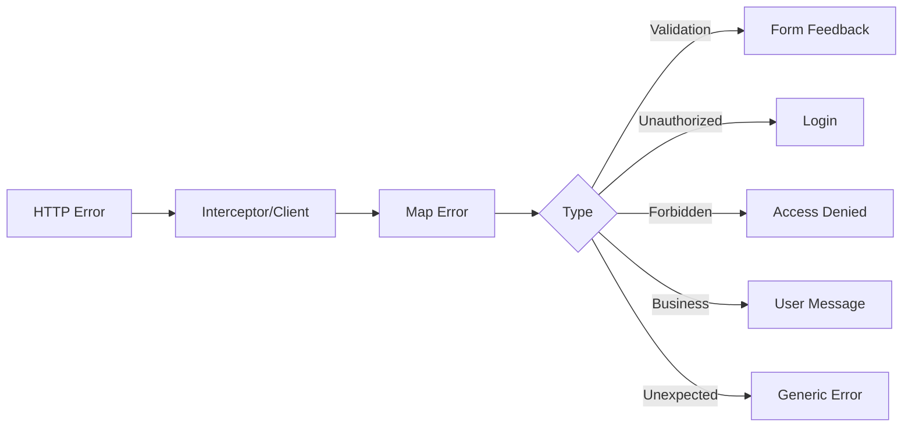

# Error Handling

## Categorias

- validação;
- autenticação;
- autorização;
- recurso não encontrado;
- conflito;
- erro de negócio;
- erro inesperado;
- indisponibilidade de serviço.

## Fluxo

## Regras

- Não mostrar stack trace ao usuário.
- Não expor detalhes internos.
- Mensagens técnicas devem ser registradas de forma segura.
- Erros de negócio devem ser apresentados de maneira compreensível.
- A aplicação deve evitar perder o contexto da operação após um erro.

## Implementação

☐ Não iniciado
☐ Parcial
☐ Completo
