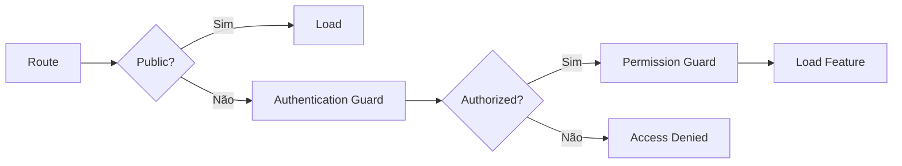

# Routing

## Princípios

- Rotas públicas devem ser explicitamente identificadas.
- Rotas autenticadas devem exigir usuário autenticado.
- Rotas administrativas devem exigir permission adequada.
- Lazy loading deve ser utilizado quando fizer sentido.
- Guards melhoram a experiência, mas não substituem autorização no backend.

## Estrutura conceitual

```text
/
├── login
├── home
├── catalog
├── benefits
├── bookings
├── profile
└── admin
    ├── employees
    ├── partners
    ├── reports
    └── settings
```

## Fluxo



## Implementação

☐ Não iniciado
☐ Parcial
☐ Completo
