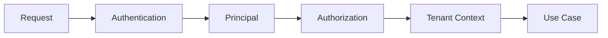

# Backend Authorization

## Princípios

- Backend é a autoridade final.
- Toda operação protegida valida autenticação.
- Permissions devem ser verificadas no backend.
- Tenant deve ser obtido do contexto autenticado quando possível.
- Nunca confiar em TenantId enviado pelo cliente.
- Menor privilégio deve ser aplicado.

## Fluxo

## Falhas

- Não autenticado → 401.
- Autenticado sem permissão → 403.
- Recurso fora do escopo → não permitir acesso.

## Implementação

☐ Não iniciado
☐ Parcial
☐ Completo
