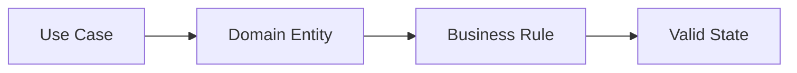

# Domain

## Responsabilidades

- representar entidades de negócio;
- manter invariantes;
- executar regras de negócio;
- definir contratos necessários ao domínio.

## Entidades

As entidades devem refletir os módulos documentados em `04_modules`.

Exemplos:

- Employee;
- Company;
- Partner;
- Benefit;
- Booking;
- Payment;
- Commission;
- Notification.

## Regras

- Não colocar lógica de negócio em Controller.
- Não colocar regra de negócio exclusivamente em SQL.
- Não depender diretamente de Entity Framework ou SDK externo quando isso quebrar a separação arquitetural.
- Entidades devem permanecer consistentes.

## Fluxo

## Implementação

☐ Não iniciado
☐ Parcial
☐ Completo
