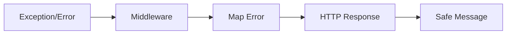

# Error Handling

## Categorias

- Validation;
- Authentication;
- Authorization;
- Not Found;
- Conflict;
- Business Rule;
- External Integration;
- Unexpected.

## Fluxo



## Regras

- Não expor stack trace em produção.
- Não expor secrets.
- Erros de negócio devem possuir código identificável.
- Erros externos devem ser mapeados.
- Erros inesperados devem ser registrados.
- Respostas devem ser consistentes.

## Exemplo

```json
{
  "success": false,
  "error": {
    "code": "BUSINESS_RULE",
    "message": "Operation cannot be completed."
  }
}
```

## Implementação

☐ Não iniciado
☐ Parcial
☐ Completo
