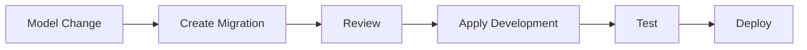

# Database Migrations

## Princípios

- Alterações de schema devem ser versionadas.
- Migration deve ser reproduzível.
- Não editar migrations já aplicadas em ambientes compartilhados.
- Mudanças destrutivas exigem planejamento explícito.
- Dados existentes devem ser considerados antes de alterar constraints ou tipos.

## Fluxo

## Alterações destrutivas

Exemplos:

- remover coluna;
- remover tabela;
- reduzir capacidade de tipo;
- alterar relacionamento.

Devem possuir estratégia de migração de dados quando necessário.

## Rollback

Quando rollback automático não for seguro, definir procedimento de recuperação.

## Implementação

☐ Não iniciado
☐ Parcial
☐ Completo
