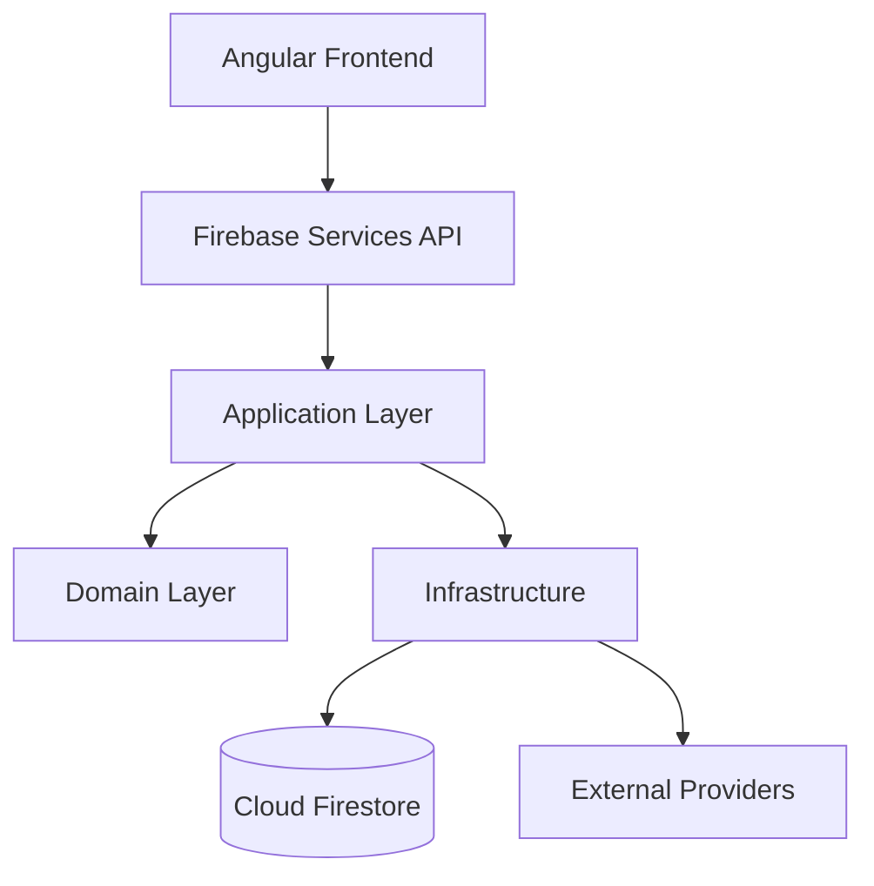

# Architecture

```mermaid
flowchart TB
FE[Angular Frontend]
API[Firebase Services API]
APP[Application Layer]
DOM[Domain Layer]
INF[Infrastructure]
DB[(Cloud Firestore)]
EXT[External Providers]

FE --> API
API --> APP
APP --> DOM
APP --> INF
INF --> DB
INF --> EXT
```

## Dependência

As dependências devem apontar para camadas internas sem permitir que o domínio dependa da infraestrutura.

## Implementação

☐ Não iniciado
☐ Parcial
☐ Completo
