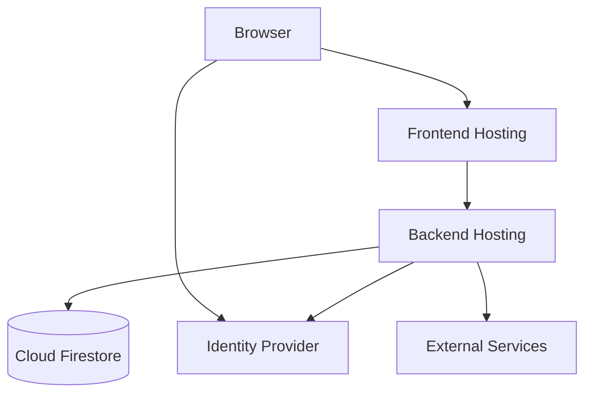

# Deployment

```mermaid
flowchart TB
USER[Browser]
HOST[Frontend Hosting]
API[Backend Hosting]
DB[(Cloud Firestore)]
ID[Identity Provider]
EXT[External Services]

USER --> HOST
HOST --> API
API --> DB
USER --> ID
API --> ID
API --> EXT
```

## Regra

Os detalhes de infraestrutura devem ser atualizados quando houver mudança real de ambiente, hosting ou banco.

## Implementação

☐ Não iniciado
☐ Parcial
☐ Completo
