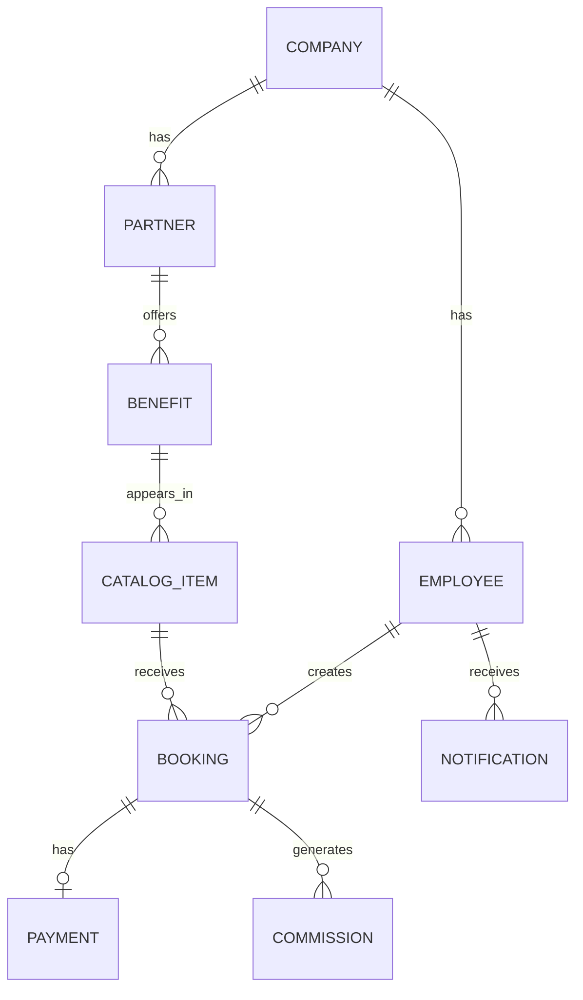

# Domain

```mermaid
erDiagram
COMPANY ||--o{ EMPLOYEE : has
COMPANY ||--o{ PARTNER : has
PARTNER ||--o{ BENEFIT : offers
BENEFIT ||--o{ CATALOG_ITEM : appears_in
EMPLOYEE ||--o{ BOOKING : creates
CATALOG_ITEM ||--o{ BOOKING : receives
BOOKING ||--o| PAYMENT : has
BOOKING ||--o{ COMMISSION : generates
EMPLOYEE ||--o{ NOTIFICATION : receives
```

## Observação

Este diagrama é conceitual. O modelo físico detalhado deve ser mantido em `07_database`.

## Implementação

☐ Não iniciado
☐ Parcial
☐ Completo
