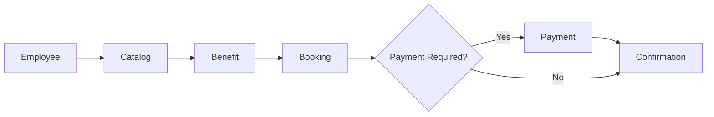
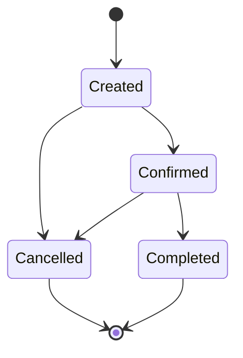

# Business Flows

## Benefício → Reserva → Pagamento

```mermaid
flowchart LR
A[Employee] --> B[Catalog]
B --> C[Benefit]
C --> D[Booking]
D --> E{Payment Required?}
E -->|Yes| F[Payment]
F --> G[Confirmation]
E -->|No| G
```

## Reserva

```mermaid
stateDiagram-v2
[*] --> Created
Created --> Confirmed
Created --> Cancelled
Confirmed --> Completed
Confirmed --> Cancelled
Cancelled --> [*]
Completed --> [*]
```

## Notificação

```mermaid
flowchart LR
A[Business Event] --> B[Notification Service]
B --> C[Channel]
C --> D[Employee]
```

## Implementação

☐ Não iniciado
☐ Parcial
☐ Completo
