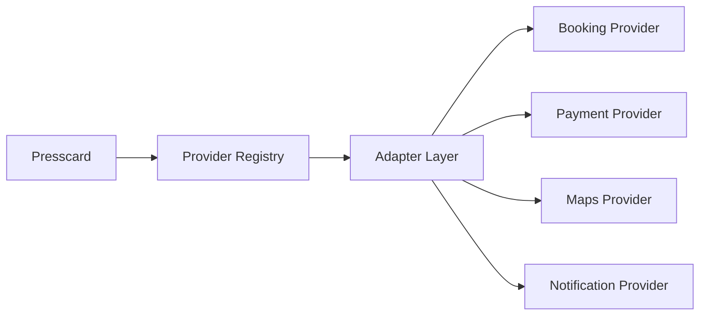
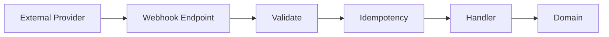

# Integrations

```mermaid
flowchart LR
APP[Presscard]
REG[Provider Registry]
AD[Adapter Layer]

APP --> REG
REG --> AD

AD --> BOOK[Booking Provider]
AD --> PAY[Payment Provider]
AD --> MAP[Maps Provider]
AD --> NOT[Notification Provider]
```

## Webhook

```mermaid
flowchart LR
P[External Provider] --> W[Webhook Endpoint]
W --> V[Validate]
V --> I[Idempotency]
I --> H[Handler]
H --> D[Domain]
```

## Implementação

☐ Não iniciado
☐ Parcial
☐ Completo
