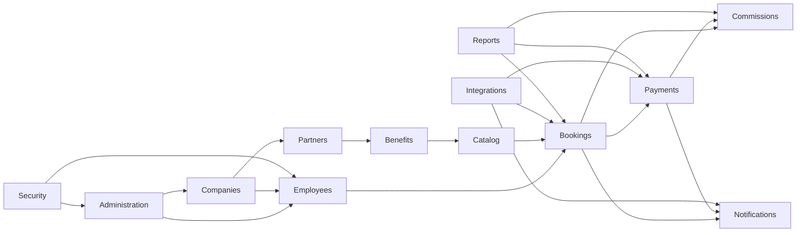

# Modules

```mermaid
flowchart LR
ADMIN[Administration]
COMP[Companies]
EMP[Employees]
PART[Partners]
BEN[Benefits]
CAT[Catalog]
BOOK[Bookings]
PAY[Payments]
COM[Commissions]
NOT[Notifications]
REP[Reports]
SEC[Security]
INT[Integrations]

ADMIN --> COMP
ADMIN --> EMP
COMP --> EMP
COMP --> PART
PART --> BEN
BEN --> CAT
EMP --> BOOK
CAT --> BOOK
BOOK --> PAY
BOOK --> COM
PAY --> COM
BOOK --> NOT
PAY --> NOT
SEC --> ADMIN
SEC --> EMP
INT --> BOOK
INT --> PAY
INT --> NOT
REP --> BOOK
REP --> PAY
REP --> COM
```

## Regra

Dependências devem ser justificadas por casos de uso reais e não criar acoplamento circular.

## Implementação

☐ Não iniciado
☐ Parcial
☐ Completo
