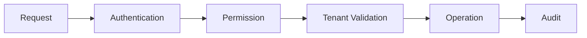

# Security

```mermaid
flowchart LR
R[Request]
A[Authentication]
P[Permission]
T[Tenant Validation]
O[Operation]
AU[Audit]

R --> A
A --> P
P --> T
T --> O
O --> AU
```

## Regra

Frontend guards são mecanismos de experiência/navegação. A decisão final de segurança permanece no backend.

## Implementação

☐ Não iniciado
☐ Parcial
☐ Completo
