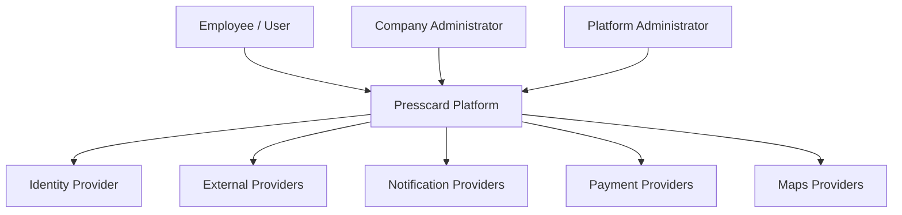

# System Context

## Regra

O diagrama representa somente relações de alto nível. Detalhes de implementação devem permanecer nos diagramas específicos.

## Implementação

☐ Não iniciado
☐ Parcial
☐ Completo
