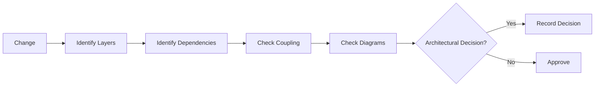

# Architecture Review

## Verificar

- A alteração respeita as camadas?
- Novas dependências apontam na direção correta?
- Existe acoplamento desnecessário?
- Algum módulo passou a conhecer detalhes internos de outro?
- Há mudança de contrato?
- Há impacto em frontend, backend, database ou integrações?
- Os diagramas continuam corretos?
- A mudança exige uma decisão arquitetural registrada?

## Fluxo

## Resultado

Classificar como:

- Approved;
- Approved with observations;
- Changes requested.

## Implementação

☐ Não iniciado
☐ Parcial
☐ Completo
