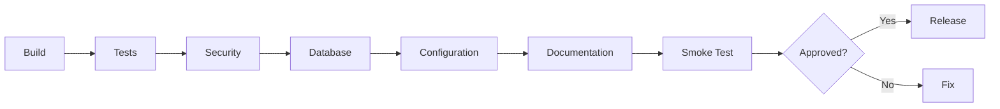

# Release Review

## Verificar

- build;
- testes;
- migrations;
- configuração de ambiente;
- secrets;
- segurança;
- logs;
- integrações;
- documentação;
- smoke test;
- rollback/recovery quando aplicável.

## Fluxo

## Implementação

☐ Não iniciado
☐ Parcial
☐ Completo
