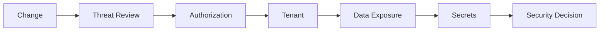

# Security Review

## Verificar

- Authentication;
- Authorization;
- Permissions;
- Tenant isolation;
- input validation;
- secrets;
- logs;
- webhooks;
- uploads/downloads;
- exposição de dados;
- privilege escalation;
- bypass de autorização.

## Fluxo

## Severidade

- Critical;
- High;
- Medium;
- Low.

## Regra

Um guard no frontend nunca é considerado mecanismo suficiente de segurança.

## Implementação

☐ Não iniciado
☐ Parcial
☐ Completo
